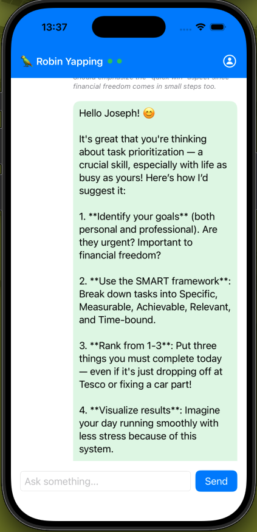
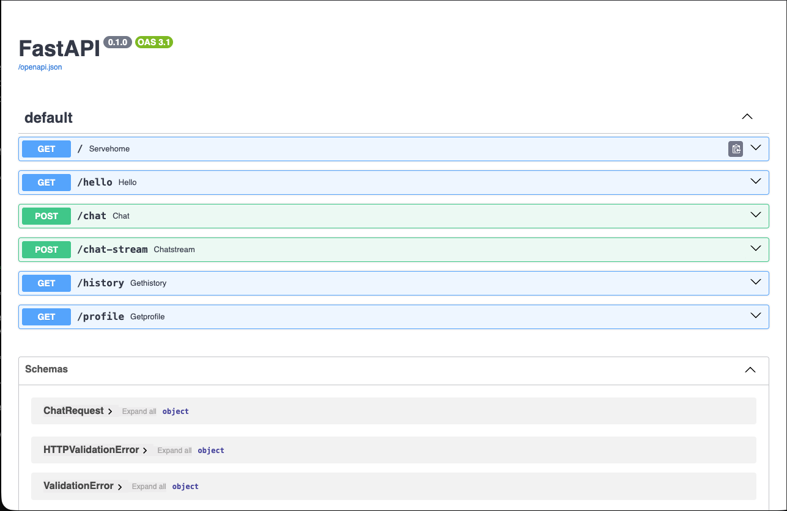

  
# Joseph Leung
**Software Product Owner & App Developer**

---

## 📄 Personal Statement

Technically experienced developer with a strong foundation in SQL, business data, and full-stack web application development. Comfortable working across both IT support and development tasks, with hands-on experience writing and optimising SQL queries, building reporting solutions, and maintaining enterprise systems. Outside of work I actively build personal projects — most recently setting up a locally hosted AI language model on my own hardware and writing a Python program to interact with it, controlling the base prompt and chat history to create a personalised assistant. Keen to contribute directly to real business projects in a collaborative team environment.

---

## 🚀 Projects

### [RobinYapping]

**Description:** *This is an iOS app to chat with the local hosted AI on my own mac. *

**Screenshots:** 

  
  &nbsp;

* *

### [joe-bot-ai]

**Description:** *This is a web API sit between the caller and the ollama server for AI communication *

**Screenshots:** 

  
  &nbsp;

* *

---

## 📫 Connect with Me

I am actively looking for new opportunities in the UK. Feel free to reach out!

<a href="https://www.linkedin.com/in/josephleungcf" target="_blank">
  LinkedIn
</a>

<!--
**fai420uk/fai420uk** is a ✨ _special_ ✨ repository because its `README.md` (this file) appears on your GitHub profile.

Here are some ideas to get you started:

- 🔭 I’m currently working on ...
- 🌱 I’m currently learning ...
- 👯 I’m looking to collaborate on ...
- 🤔 I’m looking for help with ...
- 💬 Ask me about ...
- 📫 How to reach me: ...
- 😄 Pronouns: ...
- ⚡ Fun fact: ...
-->
