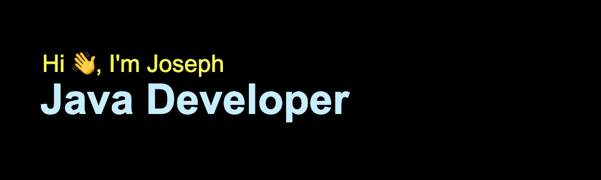

  <table>
    <tr>
      <td></td>
      <td></td>
    </tr>
  </table>

### Hi there 👋

I am actively looking forward to work as a Java developer in UK. All of my past experience was from Hong Kong but I believe my skills could be applied.

With over a decade of Java development experience, I have navigated the entire development lifecycle, from gathering requirements to deploying and testing solutions. My passion lies in tackling complex problems through code. I am eager to contribute my diverse skills and enthusiasm to a dynamic development team in our ever-evolving tech landscape.

<picture>
  <source
    srcset="https://profile-repo-41igao5ra-fai420uks-projects.vercel.app/api?username=fai420uk&show_icons=true&theme=dark"
    media="(prefers-color-scheme: dark)"
  />
  <source
    srcset="https://profile-repo-41igao5ra-fai420uks-projects.vercel.app/api?username=fai420uk&show_icons=true"
    media="(prefers-color-scheme: light), (prefers-color-scheme: no-preference)"
  />
  
</picture>

<!--
**fai420uk/fai420uk** is a ✨ _special_ ✨ repository because its `README.md` (this file) appears on your GitHub profile.

Here are some ideas to get you started:

- 🔭 I’m currently working on ...
- 🌱 I’m currently learning ...
- 👯 I’m looking to collaborate on ...
- 🤔 I’m looking for help with ...
- 💬 Ask me about ...
- 📫 How to reach me: ...
- 😄 Pronouns: ...
- ⚡ Fun fact: ...
-->
